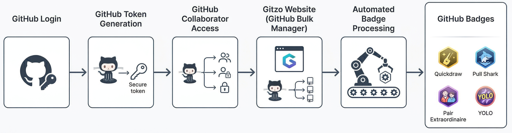
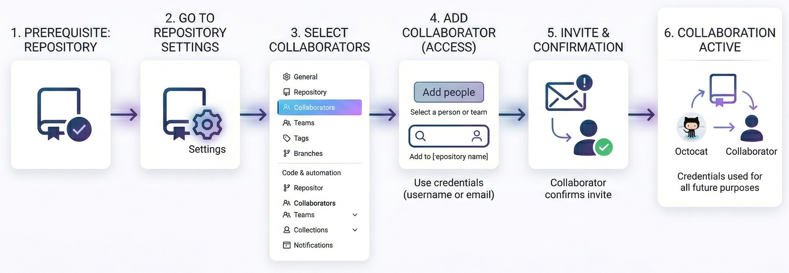
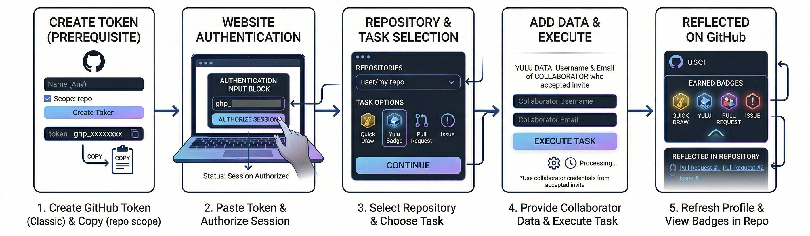

<h1 align="center">GitHubUpgrade.com</h1>

A polished GitHub OAuth workspace for achievement workflows.

## Setup

GitHubUpgrade uses GitHub OAuth. It does not accept personal access tokens in the browser.

1. Open GitHub: avatar menu -> Settings -> Developer settings -> OAuth Apps -> New OAuth App.
2. Set **Homepage URL** to `https://github-bulk-manager.vercel.app` and **Authorization callback URL** to `https://github-bulk-manager.vercel.app/api/auth/github/callback`.
3. Create the app, copy its **Client ID**, and generate a **Client Secret**.
4. In Vercel, open the project -> Settings -> Environment Variables and add `GITHUB_CLIENT_ID`, `GITHUB_CLIENT_SECRET`, and `GITHUB_REDIRECT_URI` for **Production**. Set `GITHUB_REDIRECT_URI` to `https://github-bulk-manager.vercel.app/api/auth/github/callback`, paste values without quotes, then redeploy.
5. The `/api/auth/github` and callback functions handle the OAuth code exchange. Every person with a GitHub account can sign in and only receives access to repositories GitHub grants them.

The OAuth app requests `repo` and `read:user` so the selected repository can be inspected and updated. Access is held in memory by the browser session and is never written to local storage.

<h2 align="center">Abstract</h2>

This framework automates GitHub interactions to rapidly unlock achievement badges through secure token integration, collaborator workflows, and intelligent action orchestration.

This work introduces a structured and automated framework designed to streamline the process of acquiring GitHub achievement badges. By integrating secure authentication mechanisms, collaborator-based interactions, and intelligent automation workflows, the system minimizes manual effort while maximizing efficiency. The proposed Gitzo platform leverages token-based authorization and controlled repository actions to simulate valid contribution patterns aligned with GitHub’s achievement criteria. This approach ensures rapid, reliable, and scalable badge acquisition while maintaining usability and adaptability for developers across different experience levels.

<h2 align="center">Introduction</h2>

To effectively utilize the proposed framework, specific prerequisites must be completed to ensure secure authentication and seamless system interaction. The framework operates by integrating GitHub access control mechanisms with an automated execution environment, enabling structured badge acquisition through valid interaction flows. The following figures illustrate the required setup process and the operational workflow of the system.

<h3>1. Adding Repository Collaborator</h3>

The first step involves granting collaborator access to the repository. This enables the system to perform controlled actions within the repository environment, which are essential for triggering achievement conditions.

<h3>2. Generating Personal Access Token</h3>

A personal access token is generated to securely authenticate the user within the system. This token allows the framework to interact with GitHub APIs while maintaining controlled and permission-based access.

<h3>3. Achieving GitHub Badges</h3>

Once authentication and access control are established, the system executes automated workflows that replicate valid contribution activities. These actions trigger GitHub’s achievement mechanisms, enabling badges such as Quickdraw, Pull Shark, Pair Extraordinaire, and YOLO.

<h3>4. System Working Overview</h3>

The overall system integrates user input, authentication modules, automation engines, and GitHub API interactions into a unified pipeline. The Gitzo platform orchestrates these components to ensure efficient execution, minimal latency, and reliable badge acquisition while maintaining structural consistency with GitHub workflows.

